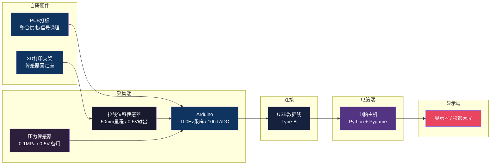

# 摩托车制动体感反应力测试系统 — PPT大纲

---

## 第1页：封面

- 项目名称：摩托车制动体感反应力测试系统
- 副标题：基于刹车手把的互动游戏开发方案
- 提案方 / 日期 / 版本号

---

## 第2页：项目背景

- **痛点**：传统产品展示靠口述和静态展板，用户无法直观感受制动手感
- **机会**：游戏化体验让用户主动参与，停留时间更长，印象更深
- **目标**：用一套体感互动装置，让每个路过的人都想上手试一试

---

## 第3页：系统总览



三层架构：**采集层 → 处理层 → 展示层**

核心硬件：拉线位移传感器（主方案）+ 压力传感器（备用方案）

---

## 第4页：硬件选型 — 拉线位移传感器（主方案）

| 参数 | 规格 |
|------|------|
| 型号 | 微型拉线位移传感器 / 拉绳电位器 |
| 量程 | 50mm（足够覆盖刹车拉杆全行程） |
| 输出信号 | 0 ~ 5V 模拟电压（线性输出） |
| 线性精度 | ±0.5% FS |
| 供电 | DC 5V（Arduino直接供电） |
| 拉力 | 自带弹簧回缩，随拉杆自动伸缩 |
| 参考价格 | ¥60 |

**安装方式：**

```
┌───────────────┐
│  刹车手把       │
│                │ ←─拉绳固定在拉杆上
│                │     ↑
└───────┬───────┘     │
        │              │
   原有刹车油管    传感器主体固定在手把根部
```

**安装步骤：**
1. 传感器主体用3D打印支架固定在手把根部不动端
2. 拉绳头固定在活动拉杆上
3. 拉杆捏下时拉动拉绳，传感器输出线性电压信号
4. 无需改动油路，3分钟安装完成

---

## 第5页：硬件选型 — 压力传感器（备用方案）

| 参数 | 规格 |
|------|------|
| 型号 | 液压压力传感器 G1/8 螺纹 |
| 量程 | 0 ~ 1.0 MPa |
| 输出信号 | 0 ~ 5V 模拟电压 |
| 供电 | DC 5V |
| 接口 | M10×1.0 或 G1/8（需匹配油管螺纹） |
| 精度 | ±1.5% FS |
| 参考价格 | ¥60 |

**安装方式（T型三通）：**

```
手把出油口
    │
  T型三通
  ├── 原刹车油管（保留，正常工作）
  └── 压力传感器（采集信号用）
```

**对比：**

| 对比项 | 拉线位移传感器 | 液压压力传感器 |
|--------|--------------|--------------|
| 安装 | 拉绳固定，免工具 | 需接油路，需排气 |
| 对原车影响 | 完全无损 | 需T型三通改动油路 |
| 信号含义 | 拉杆位移量 | 油压值 |
| 手感表现 | 位移→手部动作 | 压力→力感 |
| 可逆性 | 1秒拆除 | 可逆但费事 |

**推荐方案：拉线位移传感器** — 反应力测试更直观，安装简单，安全性高。

---

## 第6页：硬件选型 — Arduino + PCB

**Arduino Uno：**

| 参数 | 规格 |
|------|------|
| 型号 | Arduino Uno R3（兼容版） |
| 模拟输入 | 10-bit ADC，0~5V，分辨率1024级 |
| 采样率 | 100Hz（每10ms一次读数） |
| 通信方式 | USB转串口，115200 baud |
| 供电 | USB供电（电脑直接供电） |
| 价格 | ¥35 |

**PCB打板：**

- 整合传感器供电、信号调理、滤波电路
- 替代传统杜邦线飞线，稳定可靠
- 嘉立创打样5片，¥80/批

**3D打印支架：**

- 传感器固定座，适配手把安装位
- PLA材质，3次迭代打样优化
- ¥45/次 × 3次 = ¥135

---

## 第7页：硬件物料清单

| 零件 | 规格 | 数量 | 单价 | 小计 |
|------|------|------|------|------|
| 拉线位移传感器 | 50mm量程，0-5V输出 | 1 | ¥60 | ¥60 |
| 压力传感器（备用） | 0-1MPa，0-5V输出 | 1 | ¥60 | ¥60 |
| Arduino Uno | 兼容版 | 1 | ¥35 | ¥35 |
| PCB打板 | 信号调理+供电整合板 | 1批 | ¥80 | ¥80 |
| 3D打印支架 | PLA材质，3次迭代 | 3次 | ¥135 | ¥135 |
| USB数据线 | Type-B，1.5m | 1 | ¥8 | ¥8 |
| 扎带+螺丝 | 固定耗材 | 1包 | ¥5 | ¥5 |
| **硬件合计** | | | | **¥383** |

---

## 第8页：游戏玩法 — 核心概念

**游戏名称：《极限制动》**

**核心体验：**

> 屏幕出现目标信号，玩家在规定时间内将刹车力度精准控制在目标区间内，系统记录反应时间和精准度，给出评分。

**三个核心指标：**

1. **反应时间**：从信号出现到开始捏刹车的毫秒数（越低越好）
2. **力度精准度**：捏到的力度与目标区间的偏差（越准越好）
3. **稳定性**：在目标区间内保持的时长（越长越好）

---

## 第9页：游戏玩法 — 完整流程

```
① 待机画面
   └── 显示排行榜 + "捏刹车开始游戏"提示

② 玩家捏刹车 → 进入游戏

③ 倒计时准备（3-2-1）

④ 随机等待（1~4秒，防止预判）

⑤ 出现目标信号
   └── 显示：目标力度区间（如 60%~70%）
   └── 显示：限时倒计时条

⑥ 玩家捏刹车到目标区间

⑦ 实时反馈
   └── 力度条颜色变化（红→黄→绿）
   └── 进入区间后开始计时

⑧ 结果展示（5秒）
   └── 反应时间 / 精准度 / 稳定性 / 综合评分

⑨ 是否进入排行榜 → 返回待机
```

---

## 第10页：游戏玩法 — 界面设计

**主游戏界面布局：**

```
┌─────────────────────────────────────┐
│  目标区间：60% ~ 70%    剩余时间：1.2s │
│                                     │
│  ████████████░░░░░░░░  当前：58%    │  ← 力度条
│        ↑目标区间高亮                 │
│                                     │
│  反应时间：--- ms                    │
└─────────────────────────────────────┘
```

**颜色反馈：**

- 力度不足：蓝色
- 接近区间：黄色
- 进入区间：绿色（开始计分）
- 超出区间：红色

---

## 第11页：游戏玩法 — 难度分级

| 难度 | 目标区间宽度 | 限时 | 适合人群 |
|------|------------|------|---------|
| 体验模式 | 40%（如30%~70%） | 无限制 | 第一次体验的用户 |
| 挑战模式 | 20%（如45%~65%） | 2秒 | 有一定经验 |
| 极限模式 | 8%（如46%~54%） | 1.2秒 | 竞技挑战 |
| 随机模式 | 每轮随机 | 随机 | 展会竞技排名 |

**评分公式：**

```
综合评分 = (1000 / 反应时间ms) × 精准度系数 × 稳定时长加成
```

---

## 第12页：游戏玩法 — 排行榜与竞技

- **实时排行榜**：显示当日Top10，姓名 + 评分 + 反应时间
- **挑战机制**：新玩家可挑战当前第一名成绩
- **数据导出**：每场游戏数据可保存为CSV，用于后续分析
- **展会模式**：可设置展会专属排行，活动结束后公布冠军

---

## 第13页：软件架构

```
game/
├── main.py              # 程序入口，初始化串口和游戏
├── serial_reader.py     # 独立线程，持续读取Arduino数据
├── calibration.py       # 首次运行校准（最小值/最大值）
├── game_logic.py        # 游戏状态机（待机/倒计时/游戏中/结果）
├── ui/
│   ├── standby.py       # 待机界面 + 排行榜
│   ├── gameplay.py      # 游戏主界面（力度条、倒计时）
│   └── result.py        # 结果展示界面
├── data/
│   └── scores.json      # 本地排行榜数据
└── config.py            # 串口号、采样率、难度参数配置
```

**技术栈：**

- Python 3.10+
- Pygame 2.x（游戏渲染）
- pyserial（串口通信）
- 无需联网，本地运行

---

## 第14页：项目预算明细

| 项目 | 工作内容 | 工时/说明 | 金额 |
|------|---------|-----------|------|
| 硬件采购 | 传感器、Arduino、USB线 | 含两种传感器方案 | ¥163 |
| PCB打板 | 原理图设计+打样5片 | 1轮打样+验证 | ¥80 |
| 3D打印 | 支架设计+3次迭代打样 | 设计+调试迭代 | ¥200 |
| 硬件装配调试 | 传感器安装固定、接线、信号调试 | 1天 | ¥350 |
| 信号校准 | 位移零点标定、滑动滤波参数整定 | 0.5天 | ¥200 |
| 软件开发 | 串口通信模块 | 1天 | ¥300 |
| 软件开发 | 游戏逻辑与状态机 | 2天 | ¥550 |
| 软件开发 | UI界面（力度条、动画、排行榜） | 2天 | ¥550 |
| 软件开发 | 数据存储与导出功能 | 0.5天 | ¥150 |
| 联合调试 | 硬件+软件联调、体验优化、Bug修复 | 1.5天 | ¥400 |
| 项目管理 | 需求沟通、方案确认、交付文档 | 全程 | ¥250 |
| 风险预留 | 硬件返工、打样重做、现场支持 | — | ¥200 |
| **合计** | | | **¥3,000**（严格按预算上限） |

---

## 第15页：开发周期

```
第1周
  ├── Day1-2：硬件采购 + PCB打板下单 + 3D打印第一版
  └── Day3-5：传感器安装 + 信号调试 + 校准

第2周
  ├── Day1-2：串口通信 + 力度条基础UI
  └── Day3-5：游戏逻辑开发（状态机、评分）

第3周
  ├── Day1-2：完整UI开发（排行榜、结果页）
  └── Day3-5：软硬件联调 + 体验优化 + 3D支架迭代

第4周
  ├── Day1-2：压力测试 + Bug修复 + 体验优化
  └── Day3-5：交付验收 + 现场部署
```

**总周期：4周**

---

## 第16页：交付物清单

**硬件：**

- 拉线位移传感器安装调试完成（含3D打印支架）
- 压力传感器套件（备用方案，含T型三通）
- PCB信号调理板
- Arduino控制器（含固件）
- 安装说明文档

**软件：**

- 游戏程序安装包（Windows exe，双击运行）
- Python源代码（含注释）
- 配置说明文档（串口号修改、难度参数调整）

**文档：**

- 操作手册（含故障排查）
- 硬件接线图
- 项目验收报告

**售后：**

- 交付后1个月免费远程技术支持
- Bug修复响应：24小时内

---

## 第17页：风险与应对

| 风险 | 概率 | 应对方案 |
|------|------|---------|
| 传感器量程不匹配 | 中 | 提前确认刹车行程，两种传感器方案互补 |
| 3D打印尺寸不符 | 中 | 预留3次迭代预算，首版快速打样验证 |
| PCB打板有缺陷 | 中 | 打样5片，预留调试余量 |
| 信号噪声过大 | 低 | 软件滑动平均滤波 + PCB硬件滤波 |
| 电脑串口识别失败 | 低 | 提前安装驱动，测试多台电脑 |

---

## 第18页：总结

- **低成本**：¥3,000全包，硬件+软件+调试+交付
- **高体验**：毫秒级响应，游戏化展示产品制动性能
- **易部署**：双击运行，无需专业人员操作
- **可扩展**：后续可接入大屏投影、多人对战、数据深度分析

> 让每一个捏下刹车的人，都感受到这款产品的与众不同。

---

## 第19页：下一步

1. 确认刹车手把安装空间（用于3D打印支架适配）
2. 确认手把油管螺纹规格（备用传感器方案备用）
3. 签订合同，启动硬件采购和打样
4. 约定第1周末硬件验收节点
