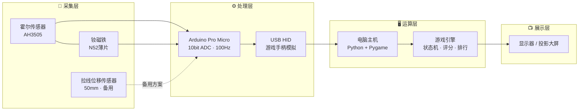

```mermaid
flowchart LR
    subgraph 采集层["🔧 采集层"]
        direction LR
        H[霍尔传感器<br>AH3505] --- M[钕磁铁<br>N52薄片]
        P[拉线位移传感器<br>50mm · 备用]
    end

    subgraph 处理层["⚙️ 处理层"]
        direction LR
        A[Arduino Pro Micro<br>10bit ADC · 100Hz]
        B[USB HID<br>游戏手柄模拟]
    end

    subgraph 运算层["🖥️ 运算层"]
        direction LR
        C[电脑主机<br>Python + Pygame]
        D[游戏引擎<br>状态机 · 评分 · 排行]
    end

    subgraph 展示层["📺 展示层"]
        E[显示器 / 投影大屏]
    end

    H & M --> A
    P -.->|备用方案| A
    A --> B --> C --> D --> E
```

> 主方案：霍尔传感器（非接触式，无磨损） / 备用方案：拉线位移传感器
